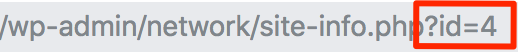

# Multisite Global Media
_Multisite Global Media_ is a WordPress plugin which shares media across the Multisite network.

## Description
This small plugin adds a new tab to the media library which allows you to share media from one site to all the other sites of the network. The `multisite-global-media.php` file uses the ID of the site that will store the global media. By default the Site ID is set to '1'. You can set/change this Site ID via the filter hook `global_media.site_id` which is run in a custom plugin like so

 ```php
 add_filter( 'global_media.site_id', function() {
     return 1234;
 } );
 ```
 
To get Global Media to work please follow these steps:

1. Decide which blog/site will host the shared media for the network.
2. Add media to the media library for the chosen blog/site.
3. Find the Site ID of your chosen site by going to your Network WP Admin. In the left hand menu choose "All Sites", and then click on "edit" under the site you need. In the address bar you will see 'site-info.php?id=4' where the last number is the ID.   

4. If the Site Id of your chosen site is '1', then you don't need to maky any changes. If it's a different ID number, then please read the section below about modifying the Site ID via hook / custom plugin. 

NB: A useful enhancement in the Multisite context is the plugin [Multisite Enhancement](https://github.com/bueltge/wordpress-multisite-enhancements).


#### Hook for Site ID

If you need to change the default Site ID '1' to another value, then you can do so by creating a small custom plugin. 

1. In /wp-content/plugins/ create a new folder 'my-plugin'

2. In /wp-content/plugins/my-plugin/ create a new file 'my-plugin.php'

3. Add the following content to 'my-plugin.php'  
Change the return value to your chosen Site ID

 ```php
<?php
/*
 * Plugin Name: My Plugin
 * Plugin URI: https://example.com
 * Description: My first plugin 
 * Author: Jane Doe 
 * Author URI: https://example.com 
 * Version: 1.0
/*	
	

/*
* MULTISITE GLOBAL MEDIA	
* https://github.com/bueltge/multisite-global-media
* change global media library ID
* 
* ****************************************************
*/

	
add_filter( 'global_media.site_id', function() {
    return 1234;
} );	

```

4. Activate the plugin for the whole network 

### Installation
* Download the plugin as zip, use a clone of the repo or use Composer, see below
* Install the plugin in your environment, recommend as [Must Use plugin](https://codex.wordpress.org/Must_Use_Plugins). See here for a quick [hint](https://github.com/bueltge/must-use-loader) for a helping solution [Must Use Loader](https://github.com/bueltge/must-use-loader).
* Set the Site ID for the Global Media Library, see above the description to change the ID with a hook.
* Active the plugin for the whole network

#### Composer
The plugin is also available as [Composer package](https://packagist.org/packages/bueltge/multisite-global-media).

```bash
composer require bueltge/multisite-global-media
```

### Screenshots
 

 

## Other Notes

### Crafted by [Inpsyde](https://inpsyde.com) &middot; Engineering the web since 2006.

### Bugs, technical hints or contribute
Please give me feedback, contribute and file technical bugs on this
[GitHub Repo](https://github.com/bueltge/Multisite-Global-Media/issues), use Issues.

### License
Good news, this plugin is free for everyone! Since it's released under the MIT, you can use it free of charge on your personal or commercial blog.

### Contact & Feedback
The plugin is designed and developed by team members from the [Inpsyde](https://inpsyde.com/) crew. Special thanks and praise to Dominik Schilling for his quick help.

Please let me know if you like the plugin or you hate it or whatever ...

Please fork it, add an issue for ideas and bugs.

### Disclaimer
I'm German and my English might be gruesome here and there.
So please be patient with me and let me know of typos or grammatical errors. Thank you!
